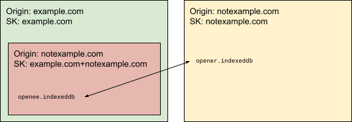
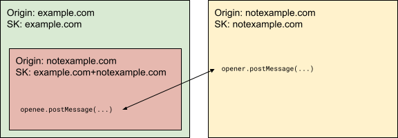

# Explainer: Opener Storage Partitioning

## Introduction

This proposal seeks to prevent or limit same-origin cross-frame communication that can bypass [storage partitioning](https://developer.chrome.com/en/docs/privacy-sandbox/storage-partitioning/), and to do so in alignment with existing work on the [Cross-Origin-Opener-Policy](https://developer.mozilla.org/en-US/docs/Web/HTTP/Headers/Cross-Origin-Opener-Policy).

## Background

[Storage partitioning](https://developer.chrome.com/en/docs/privacy-sandbox/storage-partitioning/), [shipping in M115](https://developer.chrome.com/en/blog/storage-partitioning-dev-trial/), partitions the first and third party storage buckets (and some communication APIs like BroadcastChannel, SharedWorker, and WebLocks) for a given origin. Storage partitioning seeks to prevent “certain types of side-channel cross-site tracking.”

The [Cross-Origin-Opener-Policy](https://developer.mozilla.org/en-US/docs/Web/HTTP/Headers/Cross-Origin-Opener-Policy) provides a way for a window to sever communication with cross-origin windows it opens or was opened by. A [proposed extension](https://docs.google.com/document/d/1qXlC6HZXd6UDokI8_cHYAVaXhHop0Ia6-z3fZl6saX8/edit#heading=h.c1dd4bjnvwc6) (restrict-properties) of this proposal allows for a mode with limited communication (asynchronous messages and detecting if the window was closed) between a popup and its opener.

The former proposal is primarily concerned with user privacy (e.g., preventing the average user from having their browsing unknowingly tracked in order to serve ads) whereas the latter proposal is primarily concerned with user security (e.g., ensuring even a targeted user cannot have information leaked cross-site).

The ability of windows to communicate with each other is critical to current web infrastructure, especially for payment and login models. Whatever changes are pursued in this space must proceed with care to avoid breaking the web.

## Threat Model

This section details the two threats we’re concerned with, ordered by the breadth of communication enabled by each. If synchronous scripting is possible that implies asynchronous communication is possible, but if asynchronous communication is possible that doesn’t imply synchronous scripting will be possible.

### Synchronous Scripting

If a user visits example.com which embeds an iframe for notexample.com, this iframe can open a new window for notexample.com.

Now that the first-party notexample.com window and the third-party notexample.com iframe are aware of each other, they invoke JavaScript on each other.

This is possible as long as the frames are in the same Agent Cluster.

### Asynchronous Communication
If a user visits example.com which embeds an iframe for notexample.com, this iframe can open a new window for notexample.com.

Now that the first-party notexample.com window and the third-party notexample.com iframe are aware of each other, they can use postMessage with each other.

This is possible as long as the frames are in the same COOP Group.

## Proposal

Our goal is to maintain cross-page communication where important to web function while striking a better balance with user-privacy.

This will be done in two steps. First, whenever a frame navigates cross-origin any other windows with a window.opener handle pointing to the navigating frame will have that handle cleared. Second, any frames with a valid window.opener (or window.top.opener) handle at the time of navigation will have transient storage via a StorageKey nonce instead of access to standard first- and third-party StorageKeys.

The first proposal should be less disruptive than the second, but metrics will need to be gathered on both. Once implemented, these proposals together prevent any synchronous or asynchronous communication between a first- and third-party storage bucket for the same origin. Instead, communication between two buckets for the same origin will only be possible if one of the buckets is transient. This mitigates the threats we are concerned with.

### Severing window.opener on cross-site navigation

If a frame navigates cross-origin any windows opened by that frame must have their window.opener handles cleared. The cleared handles can be restored if the opening frame navigates back in history to a state where the handles had previously been connected. If a frame navigates when it has a cleared window.opener handle, that handle will be blocked from restoration. If a frame navigates back in history to a state in which it had a window.opener handle cleared, that handle could be restored depending on the state of the opener.

The opener can be thought of as switching from a binary state (present or none) to a ternary state (present, pending, or none).

### Transient storage for frames with a window.opener

Any top-level frame with an active window.opener handle must have a transient StorageKey defined by the top-level origin and a nonce. Any sub-frames of this top-level frame will have transient StorageKeys defined by the origin of the frame and the same nonce as the top-level frame. If the window.opener handle is cleared, the next navigation of the top-level frame will have a non-transient first-party StorageKey. If the window.opener handle is cleared, navigation of a sub-frame will still be to a transient StorageKey as long as the top-level frame has a transient StorageKey.

This change depends on the first part of the proposal. You could think of the rule being rephrased as ‘any frame with (its own or a recursive parent’s) window.opener handle that’s active or cleared and restorable must have transient storage.’
